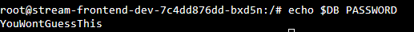
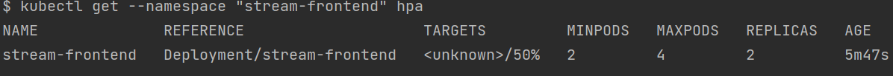

### Devops Assignment Q&A
- by Noam Strauss

----
### 1.reduce variable count

- Creating one variable file that has fewer variables to manage.

Answer: I have created one variable named "apps_config3" to configure the 3 tier app values.

----
### 2. remove duplicate code
- To iterate over a list when provisioning resources.
 ( https://learn.hashicorp.com/tutorials/terraform/for-each )

Answer: I used for-each loop to provision the 3 apps.

----
### 3.change network acl
- To change the port in the ingress -> frontend -> acl -> in variables.tf to the new port (81).
- To create a Service resource for each app.
- To create an Ingress resource for the frontend app.
- If you're using minikube use `calico` plugin for network policy to work.
- If you're using minikube you need to run `minikube tunnel` to tunnel traffic to the frontend service. 

Answer: 
 (A). lets assume Developers Changed backend port to 81 , So we need to change 
the frontend -> acl -> port in variables.tf to 81. 
 - 
(B). Created A Service for apps & Database.
(C). Created A Ingress to load balance traffic to frontend app

 

----
### 4.implement resource management
- Add cpu/memory limit to the container brackets
- Alternative: To use a LimitRange object

 
Answer: Added cpu/memory limit to the container brackets in deployments.tf.

----
### 5.make scaling possible
- We need to enable/provision metric server  (See Notes)
- Configure HorizontalPodAutoscaler (HPA) 
- You can alternatively use the kubectl to provision with the command bellow >
`kubectl autoscale --namespace="<namespacehere>" deployment <deploymenthere> --cpu-percent=70 --min=2 --max=4`
 
Answer: Provisioned HPA to Auto scale pods.

----
### 6. prepare for multi-environment
- Use terraform workspaces
 usage >> `terraform apply -auto-approve -var-file=environments/test/test.tfvars`
 
Answer: Use Terraform workspaces with .tfvar files to provision different ENVs (Usage in terraform apply ^)

----
### 7. add environment variable to service
- To Create a Secret Resource and attach to the container
(https://registry.terraform.io/providers/hashicorp/kubernetes/latest/docs/resources/secret)
- 
Answer: Created a Secret resource and attach to the during deployment to the container.

------------------------------------

#### Notes:
- If you're using minikube enable metric server using `minikube addons enable metrics-server` 
- (But currently Metric-Server has some bugs and does not work properly, see below >>.)
 

-------------------------------------
